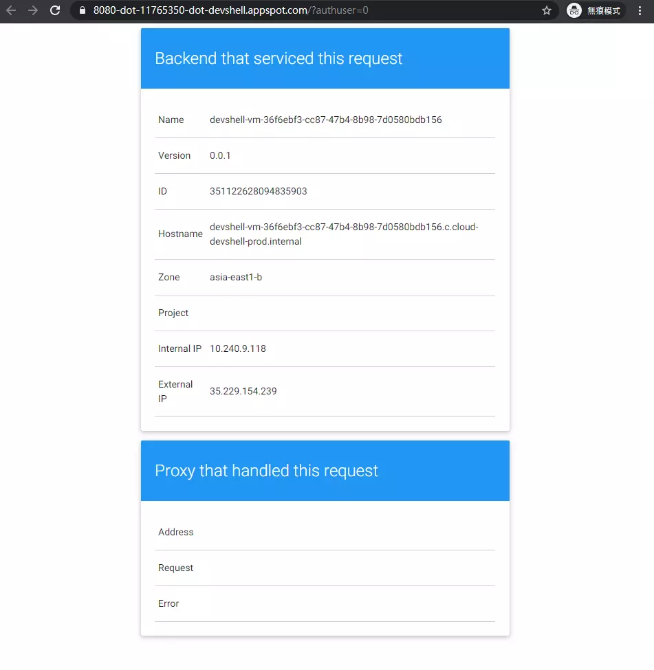
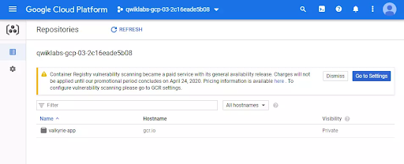

# Deploy to Kubernetes in Google Cloud: Challenge Lab

## Task 1: Create a Docker image and store the Dockerfile

- Run the following command in Cloud Shell.

```
source <(gsutil cat gs://cloud-training/gsp318/marking/setup_marking.sh)
```

- It installs the marking scripts, which use to check your progress.

- Run the commands below to clone the valkyrie-app source code repository to the Cloud Shell. (Remember to replace YOUR_PROJECT_ID with your Project ID)

```
export PROJECT=YOUR_PROJECT_ID
gcloud source repos clone valkyrie-app --project=$PROJECT
```

- Create a Dockerfile under the valkyrie-app directory and add the configuration to the file.
- Copy the given codes from the lab page to the following snippet, and then run the commands in the Cloud Shell.

```
cd valkyrie-app

cat > Dockerfile <<EOF

// COPY TO HERE

EOF
```

- Build the image with the following command:

```
docker build -t valkyrie-app:v0.0.1 .
```

- Run `docker images` to look at the images you built.

- Before clicking Check my progress in the lab page, don’t forget to run the following commands to execute the marking script:

```
cd ~/marking
./step1.sh
```

## Task 2: Test the created Docker image

- The lab instruction requires you to run the docker image built in task 1 and show the running application by Web Preview on port 8080. Based on the requirements, the docker command will be:

```
docker run -p 8080:8080 --name valkyrie-app valkyrie-app:v0.0.1 &
```

- In the Cloud Shell, go back to the `valkyrie-app` directory, and run the above command.
- Click Web Preview to see the running app.

- After that, open a new Cloud Shell to run the step2.sh marking script.

```
cd ~/marking
./step2.sh
```

# 

## Task 3: Push the Docker image in the Container Repository

- In this task, you will push the Docker image `valkyrie-app:v0.0.1` into the Container Registry with a tag `gcr.io/YOUR_PROJECT_ID/valkyrie-app:v0.0.1`.
- Thus, you should format the docker commands as below.

```
docker tag valkyrie-app:v0.0.1 gcr.io/$PROJECT/valkyrie-app:v0.0.1
docker images
docker push gcr.io/$PROJECT/valkyrie-app:v0.0.1
```

- After pushing the container, the valkyrie-app repository will appear in the Cloud Console as shown in the image below.

# 

## Task 4: Create and expose a deployment in Kubernetes

- In the Cloud Shell, go to the `valkyrie-app/k8s` subdirectory.

- Get authentication credentials for the cluster

```
gcloud container clusters get-credentials valkyrie-dev --region us-east1-d
```

- Use a text editor to modify deployment.yaml and replace `IMAGE_HERE` with `gcr.io/YOUR_PROJECT_ID/valkyrie-app:v0.0.1`
- Use `kubectl create -f` command to deploy `deployment.yaml` and `service.yaml`

## Task 5: Update the deployment with a new version of valkyrie-app

- Increase the replicas from 1 to 3

```
kubectl edit deployment valkyrie-dev
```

- Update the deployment with a new version of `valkyrie-app`
- Go back to the `valkyrie-app` directory in the Cloud Shell.

- Merge the branch called `kurt-dev` into master using the following git command:

```
git merge origin/kurt-dev
```

- Build and push the new version with tagged v0.0.2:

```
docker build -t valkyrie-app:v0.0.2 .

docker tag valkyrie-app:v0.0.2 gcr.io/$PROJECT/valkyrie-app:v0.0.2

docker images

docker push gcr.io/$PROJECT/valkyrie-app:v0.0.2
```

- Trigger a rolling update by running the following command:

```
kubectl edit deployment valkyrie-dev
```

- Change the image tag from `v0.0.1` to `v0.0.2` then save and exit.

## Task 6: Create a pipeline in Jenkins to deploy your app

In this task, you will need to:

```
- Connect to Jenkins
- Adding your service account credentials
- Creating a Jenkins job
- Modifying the pipeline definition
- Modify the site
- Kick off Deployment
```

- To connect the Jenkines,
  get the password with the following command:

```
printf $(kubectl get secret cd-jenkins -o jsonpath="{.data.jenkins-admin-password}" | base64 --decode);echo
```

-Connect to the Jenkins console using the commands below:

```
export POD_NAME=$(kubectl get pods --namespace default -l "app.kubernetes.io/component=jenkins-master" -l "app.kubernetes.io/instance=cd" -o jsonpath="{.items[0].metadata.name}")

kubectl port-forward $POD_NAME 8080:8080 >> /dev/null &
```

- If there is another running container, use the docker commands below to kill it:

```
docker ps
docker container kill $(docker ps -q)
```

- Click on the Web Preview button in cloud shell, then click “Preview on port 8080” to connect to the Jenkins console.

```
Username: admin
```

- Adding your service account credentials

```
- In the Jenkins user interface, click Manage Jenkins
- Click Manage Credentials
- Click Global credentials (unrestricted).
- Click Add Credentials in the left navigation.
- Select Google Service Account from metadata from the Kind drop-down and select the available option for others and click OK.
```

- Creating the Jenkins job

```
- Click Jenkins > New Item in the left navigation:
- Name the project "valkyrie-app", then choose the Pipeline option and click OK.
- Choose "Pipeline script from SCM" in Definition.
- On the next page, in the Branch Sources section, click Add Source and select git.
- Paste the HTTPS clone URL of your sample-app repo in Cloud Source Repositories https://source.developers.google.com/p/YOUR_PROJECT_ID/r/valkyrie-app into the Project Repository field.
- Remember to replace YOUR_PROJECT_ID with your GCP Project ID.
- From the Credentials drop-down, select the name of the credentials you created when adding your service account in the previous steps.
```

- Modifying the pipeline definition:
  Open Jenkinsfile file in a text editor, and replace `YOUR_PROJECT` with your `GCP project ID`.

- Modify the site: Open `source/html.go` file in a text editor, and change the color of headings from green to orange. Use this code to do that

```
sed -i "s/green/orange/g" source/html.go
```

- Kick off Deployment: Commit and push the changes:

```
git config --global user.email $PROJECT
git config --global user.name $PROJECT

git add *
git commit -m 'green to orange'
git push origin master
```

- Finally, manually trigger the build in the Jenkins console
