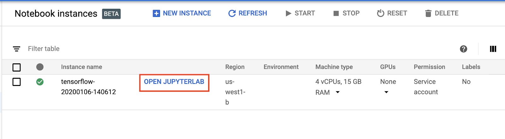

# GSP691 Reinforcement Learning: Qwik Start 
## Step 1 : Create an AI Platform Notebook
From the left-hand navigation menu, select **AI Platform > Notebooks**. Then from the top-hand menu, select **+ New Instance > TensorFlow 2.x > Without GPUs**


Then click **Create** and wait for **OPEN JUPYTERLAB** button to appear.

> :warning: **It can take upto 5 minutes for the instance to be created and OPEN JUPYTERLAB button to appear**



Click **Check my progress** to verify the objective. 

## Step 2: Clone the sample code
Click on the Terminal icon and input.
```
git clone https://github.com/GoogleCloudPlatform/training-data-analyst.git
```

Click **Check my progress** to verify the objective. 


