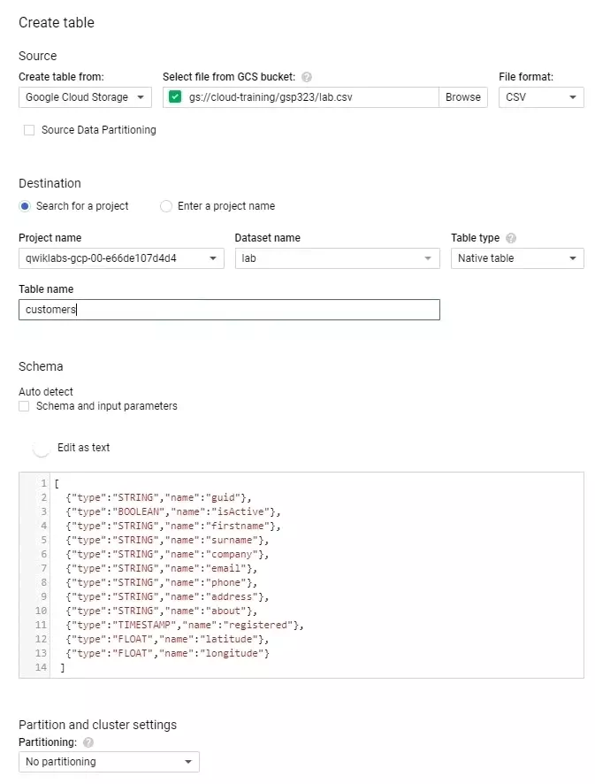

# Perform Foundational Data, ML, and AI Tasks in Google Cloud: Challenge Lab

## Task 1: Run a simple Dataflow job

### Create a BigQuery dataset called lab

- In the Cloud Console, click on Navigation Menu > BigQuery.
- Select your project in the left pane.
- Click CREATE DATASET.
- Enter ```lab``` in the Dataset ID, then click Create dataset.

- Run ```gsutil cp gs://cloud-training/gsp323/lab.schema .``` in the Cloud Shell to download the schema file.
- View the schema by running ```cat lab.schema```.

- Go back to the Cloud Console, select the new dataset lab and click Create Table.
- In the Create table dialog, select Google Cloud Storage from the dropdown in the Source section.
- Copy ```gs://cloud-training/gsp323/lab.csv``` to Select file from GCS bucket.
- Enter ```customers``` to “Table name” in the Destination section.
- Enable Edit as text and copy the JSON data from the lab.schema file to the textarea in the Schema section.
- Click Create table.

# 


### Create a Cloud Storage bucket

- In the Cloud Console, click on Navigation Menu > Storage.
- Click CREATE BUCKET.
- Copy your GCP Project ID to Name your bucket.
- Click CREATE.


### Create a Dataflow job
- In the Cloud Console, click on Navigation Menu > Dataflow.
- Click CREATE JOB FROM TEMPLATE.
- In Create job from template, give an arbitrary job name.
- From the dropdown under Dataflow template, select Text Files on Cloud Storage BigQery under “Process Data in Bulk (batch)”. (DO NOT select the item under “Process Data Continuously (stream)”).

# 

- Under the Required parameters, enter the following values:

```
JavaScript UDF path in Cloud Storage:       gs://cloud-training/gsp323/lab.js

JSON path:              gs://cloud-training/gsp323/lab.schema

JavaScript UDF name:            transform

BigQuery output table:          YOUR_PROJECT:lab.customers

Cloud Storage input path:           gs://cloud-training/gsp323/lab.csv

Temporary BigQuery directory:       gs://YOUR_PROJECT/bigquery_temp

Temporary location:                 gs://YOUR_PROJECT/temp
```

Replace ```YOUR_PROJECT``` with your project ID.

- Click RUN JOB.

=====================

# 
