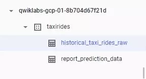
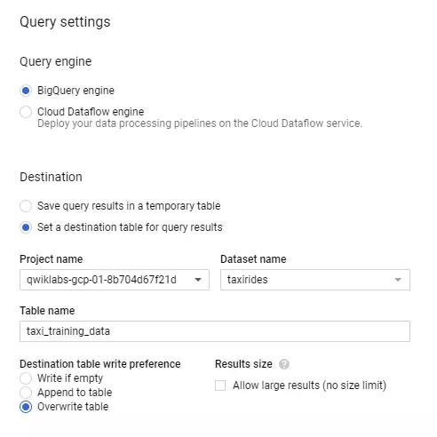
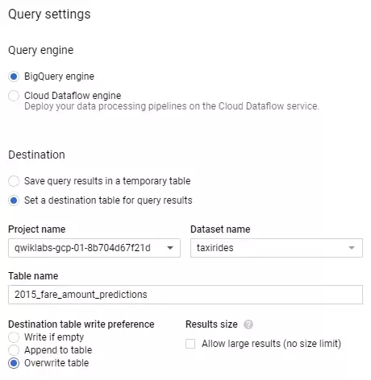
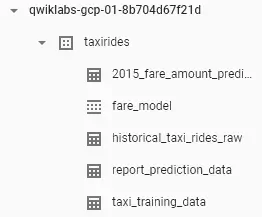

# Engineer Data in Google Cloud: Challenge Lab
## Task 1: Clean your training data
In this task, you need to make a copy of `historical_taxi_rides_raw` to `taxi_training_data` in the given `taxirides` dataset in BigQuery.

# 

Make sure you read the task description.

Do the following steps:
- In the Cloud Console, navigate to **Menu** > **BigQuery**.
- Click on **More** > **Query settings** under the Query Editor.

- Select Set a destination table for query results under Destination; Enter `taxi_training_data` as the Table name.
# 
- Click **Save**.
- **Run** the following SQL query
```
CREATE OR REPLACE TABLE
  taxirides.taxi_training_data AS
SELECT
  (tolls_amount + fare_amount) AS fare_amount,
  pickup_datetime,
  pickup_longitude AS pickuplon,
  pickup_latitude AS pickuplat,
  dropoff_longitude AS dropofflon,
  dropoff_latitude AS dropofflat,
  passenger_count AS passengers,
FROM
  taxirides.historical_taxi_rides_raw
WHERE
  RAND() < 0.001
  AND trip_distance > 0
  AND fare_amount >= 2.5
  AND pickup_longitude > -78
  AND pickup_longitude < -70
  AND dropoff_longitude > -78
  AND dropoff_longitude < -70
  AND pickup_latitude > 37
  AND pickup_latitude < 45
  AND dropoff_latitude > 37
  AND dropoff_latitude < 45
  AND passenger_count > 0
```
 Click **Check My Progress**.

## Task 2: Create a BQML model called `taxirides.fare_model`
In this task, you need to create a model called `taxirides.fare_model` and train the model with an RMSE < 10.
Do read the task description.

##### Code to create the desired Model:
```
CREATE or REPLACE MODEL
  taxirides.fare_model OPTIONS (model_type='linear_reg',
    labels=['fare_amount']) AS
WITH
  taxitrips AS (
  SELECT
    *,
    ST_Distance(ST_GeogPoint(pickuplon, pickuplat), ST_GeogPoint(dropofflon, dropofflat)) AS euclidean
  FROM
    `taxirides.taxi_training_data` )
  SELECT
    *
  FROM
    taxitrips
```
- Click **Run** and the Machine Learning process will take around 2-3 minutes.

#### Evaluate model performance:

After the training completed, you can evaluate the **Root Mean Square Error (RMSE)** of the prediction model using the following query.
```
#standardSQL
SELECT
  SQRT(mean_squared_error) AS rmse
FROM
  ML.EVALUATE(MODEL taxirides.fare_model,
    (
    WITH
      taxitrips AS (
      SELECT
        *,
        ST_Distance(ST_GeogPoint(pickuplon, pickuplat), ST_GeogPoint(dropofflon, dropofflat)) AS euclidean
      FROM
        `taxirides.taxi_training_data` )
      SELECT
        *
      FROM
        taxitrips ))
```
Click **Check My Progress**.

## Task 3: Perform a batch prediction on new data

In this task, you need to use the BQML model to predict the taxi fares of the data given in the `taxirides.report_prediction_data` table.

Do the following Steps:

- Select **Set a destination table for query results** under Destination; Enter `2015_fare_amount_predictions` as the Table name.

# 

- Click Save
- Run the following SQL query.
```
#standardSQL
SELECT
  *
FROM
  ML.PREDICT(MODEL `taxirides.fare_model`,
    (
    WITH
      taxitrips AS (
      SELECT
        *,
        ST_Distance(ST_GeogPoint(pickuplon, pickuplat)   , ST_GeogPoint(dropofflon, dropofflat)) AS    euclidean
      FROM
        `taxirides.report_prediction_data` )
    SELECT
      *
    FROM
      taxitrips ))
```

At the end of the lab, your BigQuery dataset should contains the following tables.

# 

Click **Check My Progress**.

### End the lab once you get the score 100/100 :)
